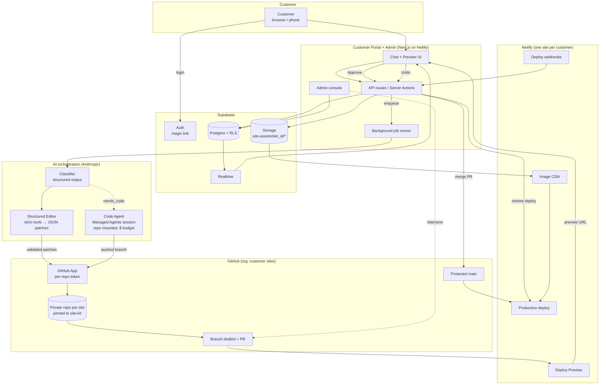

# AI Website Manager — Architecture Recommendation & Build Plan

> Architecture recommendation and build plan for the AI Website Manager platform. The master prompt for building it is in CLAUDE_CODE_HANDOFF.md.
>
> Items marked **[verify]** are facts I could not confirm from inside this session and should be checked once in the Netlify / GitHub / Anthropic consoles before Phase 2 starts. None of them change the architecture.
>
> **Decisions confirmed with the owner (2026-10-04):** (1) the platform code lives in a **new repo** (proposed `avue57-ai/site-manager`); TET only receives these two documents. (2) Bespoke code-level changes are **operator-reviewed** in the MVP: the code agent is built in Phase 6 but its output lands in the admin queue before a customer sees it. (3) **Free tiers where possible**, with explicit upgrade triggers (see §6 "Free-tier operating rules"). (4) **La Soirée is the Phase 1 pilot** migration.
>

## Context

Today each customer website is built by Claude as a one-off Astro static site, pushed to GitHub, and deployed on Netlify. The La Soirée Bridal site (github.com/avue57-ai/la-soiree-bridal → la-soiree-bridal.netlify.app) is the reference build. It works well for delivery, but post-delivery changes have no good path: the customer either edits raw collections in Sveltia CMS (covers ~40% of visible content, writes straight to `main`, can break the build) or asks us to open Claude Cowork by hand.

The goal is a multi-tenant product where each paying customer logs into a portal, describes a change in plain language (optionally with images), sees a preview, and approves it to production, with no knowledge of code, Git, Netlify or CMS schemas, and with no way to accidentally break their site. It must scale to hundreds of sites with low marginal maintenance, low AI cost, strong tenant isolation and minimal human intervention.

---

## 1. Executive recommendation

**Build Option C, but with a specific shape: a structured, schema-validated content layer that is expressive enough to absorb almost every request (Levels 1–3 and most of Level 4), with an isolated coding agent only for the residual bespoke design/feature work. Git stays the single source of truth per site; Netlify stays the build, preview and hosting layer.**

Why this and not the alternatives:

- **Option A (AI edits code for everything)** is the wrong default. "Change our hours" should never cost a 3-minute sandboxed agent run at $1–5 with a non-zero chance of breaking a build. Over hundreds of sites, a code agent touching every site on every request also makes each site drift into a bespoke codebase nobody can maintain.
- **Option B (pure CMS)** is too rigid. Customers will ask for "move this section up", "make this page feel more modern", "add a page for our new location". A CMS that cannot model layout, theme and page composition pushes all of that back to us.
- **The deciding insight from the La Soirée repo:** the design is already separable from the content, but the separation is incomplete and unvalidated. Finishing that separation (pages as ordered section lists, nav/footer/theme as data, Zod schemas on everything, images out of the repo) turns "layout" and "new page" requests into JSON edits. The AI's main job becomes *translating language into validated JSON patches*, which is cheap (≈ $0.05–0.10 per edit), fast, deterministic to validate, and impossible to use to break the build.
- **The coding agent still exists** (new section types, bespoke redesigns, integrations) but runs in an isolated per-session sandbox against one repo on a branch, with a hard dollar budget, must pass build + checks, and goes through the same preview → customer approval gate. In the MVP it runs behind an operator review step; V2 removes the operator.

Everything the customer sees is one experience: *describe → preview → approve → live*, with one-click undo. Internally every change is a Git commit on a branch, a Netlify deploy preview, a merge to a protected `main`, and a recorded revision that can be restored instantly.

**Stack in one line:** Next.js portal on Netlify · Supabase (Postgres/Auth/Storage/Realtime) · GitHub App + one private repo per site from a template · Netlify (one site per customer, deploy previews, Image CDN, API) · Anthropic Claude API with strict tools for structured edits · Anthropic Managed Agents (fallback: Claude Agent SDK in a sandbox) for code edits · a shared `site-kit` Astro package that defines the Site Standard.

**Alternatives considered and rejected**
| Alternative | Why not |
|---|---|
| Headless CMS (Sanity/Contentful/Payload) as the content store | Two sources of truth (content in a DB, design in Git), two version histories, extra vendor per site; Contentful is uneconomic at hundreds of small sites. Git-backed content already works and gives history for free. |
| Netlify Visual Editor (ex-Stackbit) | Enterprise-only, enabled via Netlify Support, pricing not public. We are building the editor anyway. |
| Netlify Agent Runners as the code engine | Dashboard/CLI only, **no public API**; AI billed at a ~20% markup. Not automatable from our platform. |
| Keep Sveltia CMS as the customer tool | Needs a GitHub account per owner, a public repo on the free plan, writes straight to `main`, covers ~40% of content, can break builds. Fine as an optional operator fallback. |
| Store images in Git (current approach) | La Soirée's repo is ~255 MB of images; LFS is now metered; GitHub blocks files >100 MB; every CMS upload is reprocessed per build. Object storage + Netlify Image CDN is cheaper and removes build-time processing. |
| Build previews on our own infrastructure from day one | Netlify builds cost nothing for previews and need no infra. Revisit at scale if the 3-concurrent-build limit bites (see §11). |
| Claude Agent SDK self-hosted as the primary code engine | Requires us to run and secure sandboxes. Managed Agents does that with a git proxy and dollar budgets. Kept as the fallback behind one interface. |

---

## 2. Current-state assessment

Source: the prior session's handoff doc and a full read of `avue57-ai/la-soiree-bridal` (shallow clone; Netlify project settings not visible from here).

**How a site is produced and shipped today**

1. Claude crawls the customer's existing site, redesigns it, and builds an Astro 5 static site (no SSR, no adapter). La Soirée: 112 pages, Lighthouse 97–100, ~5 KB JS.
2. Content partly lives in `content/` as JSON/Markdown (gowns, designers, journal, business details, appointment menu, FAQ, testimonials), loaded by hand-written `src/data/*.js` modules via `import.meta.glob`. **No Astro Content Collections, no Zod schemas, no validation** — a bad edit surfaces as a build crash or silently missing content.
3. Everything else is hardcoded in `.astro` files: every homepage headline and paragraph, the homepage section order (one 437-line `index.astro` with inline CSS/JS), nav (`src/data/site.js`), footer, About/Experience/VIP/Book/Contact copy, page titles/meta, wordmark, design tokens, JSON-LD fragments, `llms.txt`. Business facts (prices, guest counts, phone, price range) are duplicated in ~12 code locations.
4. Images: originals in `media-source/` (135 MB) are converted at build (`scripts/optimize-images.mjs`, sharp → AVIF/WebP at 3–4 widths + 1200×630 OG cards) into `public/img` (119 MB, committed) with a manifest `src/data/images.json`. Content references `/media-source/...` paths resolved via `src/lib/img.js` + `Pic.astro`. Known fragilities: no try/catch (one bad upload fails the build), CMS uploads are re-processed on every build because outputs aren't committed back, deleted sources leave orphans, 30-day cache on non-hashed URLs, OG card gaps when a cover photo is reordered.
5. QA: `scripts/check.mjs` validates titles, descriptions, single h1, alt text, JSON-LD parse, internal links and srcsets across `dist/` — **run manually, not part of the Netlify build**. No tests, no CI.
6. Deploy: `netlify.toml` (`npm run build`, publish `dist`, Node 22, cache headers). Netlify is Git-connected to `main` **[verify]** (CMS docs say every save rebuilds in ~1–2 min; the handoff also mentions CLI `netlify deploy --prod`). Netlify Forms for contact.
7. Editing: Sveltia CMS at `/admin/` (GitHub backend, Netlify OAuth gateway, commits directly to `main`). Requires the repo to be **public** (free-plan constraint) and the owner to have a GitHub account.

**What can be reused (a lot)**

| Asset | Reuse |
|---|---|
| Astro 5 + static output + `netlify.toml` conventions | Keep as the rendering layer of the Site Standard. |
| `content/` JSON/Markdown convention, slug = filename | Keep; formalize with Content Collections + Zod. |
| Collection shapes (gowns, designers, journal, business, appointments, faq, testimonials) | Become typed collections in the Standard (generic: `products`, `brands`, `posts`, `business`, `pricing`, `faq`, `testimonials`). |
| `Pic.astro` + responsive AVIF/WebP approach | Keep the component API; swap the backend to remote assets + Netlify Image CDN. |
| `scripts/check.mjs` | Keep; extend with content-schema checks; run in the build. |
| Design-token approach in `global.css` `:root` | Becomes `content/settings/theme.json` → generated CSS variables. |
| Redirect handling, JSON-LD, sitemap, OG cards | Keep as framework features. |
| Netlify Git-connected builds, Forms | Keep. |
| Sveltia CMS | Drop for customers (the AI portal replaces it); optional operator fallback. |

**What must change**

- Finish the data/design separation (pages, sections, nav, footer, theme, meta → data).
- Schemas and a machine-readable **site manifest** so an AI can know what is editable.
- Images out of Git into object storage + CDN transforms.
- Private repos, platform-owned GitHub App commits (no customer GitHub accounts).
- Branch-based previews and a protected `main` (no direct writes).
- `check` in the build; build failures can never reach production.

---

## 3. Proposed architecture

```
Customer (browser / phone)
   │  magic-link login · chat · image upload · preview iframe · Approve/Undo
   ▼
Customer Portal  (Next.js on Netlify)  ──────────────┐
   │  REST/Server Actions · Supabase Auth · Realtime  │ Admin Console (same app, /admin, role-gated)
   ▼                                                  │
Platform API + Job Runner  (TypeScript; Netlify Functions + Background Functions)
   │  edit_request state machine · rate limits · audit log · usage metering
   ├──► AI Orchestration layer
   │      ├─ Classifier (Claude, structured output): scope, level, feasibility
   │      ├─ Structured Editor (Claude + strict tools): NL → validated JSON patches   ← L1, L2, L3, structured L4
   │      └─ Code Agent Runner (Anthropic Managed Agents; fallback Agent SDK sandbox) ← residual L3/L4
   ├──► Content/Repo layer
   │      ├─ GitHub App (per-site, per-job installation token scoped to ONE repo)
   │      ├─ One private repo per site, generated from `site-template`, pinned to `@kit/site-kit@x.y`
   │      ├─ Branch `draft/<id>` + PR  →  Deploy Preview            (never writes to main directly)
   │      └─ Protected `main` = production
   ├──► Asset layer
   │      ├─ Supabase Storage bucket `site-assets/<site_id>/...` (originals, sharp-normalized)
   │      └─ Netlify Image CDN transforms at request time (per-site remote_images allowlist)
   └──► Deploy layer (Netlify)
          ├─ Deploy Preview per PR  →  preview URL shown in portal
          ├─ Approve = squash-merge PR → production build from main (+ optional instant publish of the preview deploy)
          ├─ Undo = restore previous production deploy (instant) + revert commit
          └─ Deploy notification webhooks → platform updates deployment/revision rows

Data: Supabase Postgres (RLS by org) — orgs, users, sites, conversations, messages, drafts,
      edit_requests, change_sets, deployments, revisions, assets, ai_runs, audit_log, usage
```

**Responsibility split**

| Concern | Owner | Why |
|---|---|---|
| Auth, DB, file storage, realtime job status | Supabase | One vendor for the platform backend; RLS gives tenant isolation at the data layer. |
| Site source of truth, version history, diff/rollback | GitHub (one repo per site) | Git already gives immutable history and branch isolation; GitHub App tokens can be scoped to one repo per job. |
| Builds, previews, production hosting, domains, forms, image transforms, deploy rollback | Netlify | Already in use; deploy previews + restore + Image CDN + API cover every need; no reason to move. |
| Long-running jobs (AI loop, commits, deploy polling) | Netlify Background Functions (15 min, available on all credit-based plans; sync functions are capped at 60 s); code written as portable modules | Keeps the MVP on one host; can move to a tiny worker container later without rewrites. Netlify "Async Workloads" (durable, retrying, 15 min/step) is the upgrade path if the job state machine outgrows plain background functions. |
| Structured edit intelligence | Claude Messages API (strict tools, structured outputs, prompt caching) | Cheap, fast, deterministic to validate; tools are server-bound to one site. |
| Code-level edits | Anthropic Managed Agents (beta) → fallback Claude Agent SDK in Fly/E2B sandbox | Hosted per-session container, repo mounted via git proxy (token never in sandbox), hard dollar budget, webhooks. |
| What Netlify should NOT do | Tenant auth (Netlify Identity's deprecation was reversed in Feb 2026, but it is visitor auth with no tie to our data model), database, asset originals (Blobs has no access control; Storage + RLS is simpler), AI orchestration (Agent Runners have no API). | Use the right tool; keep Netlify to build/deploy/CDN. |

**Netlify cost model that shaped these choices (credit-based plans, verified Oct 2026):** Deploy Previews and branch deploys cost **0 credits**; a production deploy costs **15 credits**; bandwidth 20 credits/GB; compute 10 credits/GB-hour. Pro is $20/month for 3,000 credits with unlimited seats, with tiers up to 20,000 credits/$126 and top-ups at 1,000/$20. Self-serve teams are capped at **500 projects** and **3 concurrent builds** (+$40/month each). So: previewing is free, publishing is ~$0.10–0.30, and build concurrency, not build minutes, is the scaling constraint.

---

## 4. Architecture diagram (Mermaid; renders on GitHub)



---

## 5. Customer workflow (prompt → live)

Example: *"Replace the main homepage photo with this one and change 'Michigan's Premier Bridal Boutique' to 'Luxury Bridal, Personally Curated.'"* + 1 image.

| # | Step | System behaviour | Customer sees |
|---|---|---|---|
| 1 | Submit | Portal creates `message` + `edit_request(status=received)`; image uploaded to Storage under `site_id/uploads/`, `asset` row created (`status=processing`). Rate limit + open-draft check (one active draft per site). | "Working on it…" |
| 2 | Asset prep (async) | sharp: EXIF rotate, strip metadata, cap 4000 px, convert HEIC→JPEG, record w/h/bytes/mime, dominant colour. Claude vision writes `description` + `suggested_alt`. Asset → `ready`. | — |
| 3 | Classify | Claude (structured output) over the **site manifest** (pages, sections, editable fields, collections index) + request + asset descriptions → `{level, scope:[content paths], feasibility: structured \| needs_code \| needs_clarification, question?}`. | If ambiguous: one short question ("Which photo do you mean, the large one at the top or the one under 'Private, Curated, Personal'?") |
| 4 | Apply (structured) | Claude tool loop: `read_content`, `search_content`, `propose_changes(ops)`. Server validates ops against Zod schemas + cross-refs (asset exists, relation slugs exist, enum values), applies in memory, re-validates. Produces a plain-English change summary. ≤ N ops / files per request. | — |
| 4b | Apply (code) | Residual only. MVP: operator queue (admin console) → operator runs the Code Agent or edits by hand on the draft branch. V2: Managed Agents session auto-started with repo mounted, budget cap, `npm run build && npm run check` must pass before push. | "This one needs a designer's touch. We'll have a preview for you within one business day." |
| 5 | Commit | GitHub App mints a 1-hour token scoped to **this repo only**; Git Data API writes blobs/tree/commit on `draft/<draft_id>` (created from `main` if new); opens/updates PR titled with the request summary. | — |
| 6 | Build preview | Netlify builds the Deploy Preview (`npm run build` runs schema check, image refs check, `check.mjs`). Deploy webhook → `deployment(state=ready, url)`. Build failure → one automatic AI retry with the build log; second failure → operator queue + customer message. | Progress: "Building your preview (usually about a minute)" → preview iframe loads `deploy-preview-N--site.netlify.app`, with changed areas listed. |
| 7 | Review | Buttons: **Approve & Publish**, **Keep Editing** (next request appends commits to the same draft; preview rebuilds), **Discard**. | Preview + summary of what changed. |
| 8 | Publish | Approve → squash-merge PR to protected `main` (only the App can merge) → Netlify production build (15 credits) → webhook → `revision` row (commit sha + deploy id + summary) → draft closed. Optional optimisation: also call Netlify `POST /sites/{id}/deploys/{preview_deploy_id}/restore` on the already-built preview deploy so the change is live instantly while `main` rebuilds **[verify the restore endpoint accepts a deploy-preview deploy]**. | "Your website has been updated." + link. |
| 9 | Undo | Portal "Undo last change" → Netlify restore of the previous revision's deploy (instant) + revert commit on `main` (keeps repo and site in sync) → new revision row `restored_from`. History page lists every revision with "Restore". Netlify keeps deploys 90 days on paid plans (the published and latest successful deploys are always kept), so revisions older than that restore by rebuilding from the recorded commit (branch `restore/<sha>` → build → publish, ~2 min). | Site back to prior state within seconds (or ~2 min for old revisions). |

Everything in the loop is logged: `ai_runs` (model, tokens, cost, latency, request-id), `audit_log` (who did what), `usage` counters per org.

---

## 6. Technology stack

| Component | Technology | Purpose | Why selected |
|---|---|---|---|
| Portal + admin UI | **Next.js (App Router), TypeScript, Tailwind, shadcn/ui**, deployed on Netlify | Customer chat/preview UI, admin console, API routes | Boring, well-documented, first-class on Netlify; one app for customer + admin keeps the MVP small. |
| Auth | **Supabase Auth, magic link (email OTP)** via Resend SMTP (custom SMTP is mandatory: Supabase's default mailer allows 2 emails/hour) | Passwordless login for non-technical owners; admin role flag | No passwords to support; Supabase Auth integrates with RLS; Netlify Identity is visitor auth, not tenant auth. |
| Database | **Supabase Postgres + RLS** (Free tier in MVP, kept awake by a daily ping; Pro at the trigger in the table below) | Tenants, sites, conversations, requests, revisions, usage, audit | Relational fits the state machines; RLS enforces tenant isolation in the data layer, not just app code. |
| Realtime | **Supabase Realtime** (Postgres changes) | Live job status in the portal | Already included; avoids a websocket service. |
| File storage | **Supabase Storage** (bucket per environment, prefix per site, RLS policies) | Image originals, downloadable files | Same vendor; signed/public URLs; works as a remote origin for Netlify Image CDN. |
| Image delivery | **Netlify Image CDN** (`/.netlify/images?url=…&w=…&fm=avif`) with per-site `remote_images` allowlist | Resizing, format negotiation, caching at the edge | Removes build-time image processing and repo bloat; already in Netlify; per-site allowlist = isolation. |
| Background jobs | **Netlify Background Functions** (≤15 min, async, all plans; 256 KB payload so jobs carry IDs, not data) + Netlify deploy webhooks | AI loops, GitHub commits, deploy tracking | Stays on one host; functions are plain TS modules → movable to a worker container (Fly.io) if limits bite. |
| Source control | **GitHub organisation** (Free in MVP, private repos, write access held only by the platform App; Team plan $4/seat when rulesets are wanted) + **GitHub App** | One repo per site; per-job tokens scoped to one repo; PRs for previews; `main` protected by access control now and by a ruleset (App as sole bypass actor) after the upgrade | Already in use; installation tokens with `repository_ids:[id]` (1-hour lifetime) give per-tenant credentials; `POST /repos/{tpl}/generate` makes provisioning one API call; 5,000+ requests/hour per installation is ample. |
| Site framework | **Astro 5 static** + **`@kit/site-kit`** (shared npm package: section components, Zod schemas, layouts, Pic, check scripts) + **`site-template`** repo | The Site Standard every customer site follows | Proven by the current build; a shared package means one upgrade path for hundreds of sites. |
| Hosting/CI | **Netlify** (one site per customer, Git-connected, Deploy Previews, Forms, domains, deploy restore, API). Two teams: `customer-sites` and `platform` so a credit cap on dev work can never pause a customer's site | Build, preview, production, rollback, custom domains | Existing; covers every requirement without extra services. |
| Structured AI | **Anthropic TypeScript SDK**, Messages API: `claude-opus-5-5` default (effort `medium`), strict tools, `output_config.format` structured outputs, prompt caching (1h TTL on manifest/system) | Classification and NL → JSON patch | Highest-quality interpretation of vague customer language; caching makes per-edit cost ≈ $0.05–0.10. Measure, then route classification/alt-text to `claude-sonnet-5-5` / `claude-haiku-4-5` where quality holds. |
| Code AI | **Anthropic Managed Agents** (beta, enabled for all API accounts): agent + environment with `limited` networking (`allow_package_managers: true` covers github.com + registry.npmjs.org), `github_repository` resource, session `budget`, webhooks. Sandboxes ship Ubuntu 24.04 with Node 22 and git. $0.08 per running session-hour + tokens. Fallback: **Claude Agent SDK** in an E2B/Daytona/Fly sandbox (~$0.05/vCPU-hour) behind the same `CodeAgentRunner` interface | Residual design/feature changes | Hosted sandbox, token never enters the container, hard dollar cap, no infra to run; swappable if the beta changes. |
| Email | **Resend** | Magic links, "your preview is ready", "published" notifications | Simple API, generous free tier. |
| Errors/monitoring | **Sentry** + Postgres audit/usage tables + admin dashboards | Visibility, intervention | Minimal; dashboards come from our own tables. |
| Payments | *Not in MVP* (Stripe later) | — | Billing can be manual for the first customers. |

Deliberately **not** introduced: a headless CMS (two sources of truth), a queue service (Postgres `jobs` table + background functions suffice), Kubernetes/containers we run (Managed Agents hosts the sandbox), Netlify Visual Editor (enterprise-priced; we are building the editor), Git LFS (assets leave Git).

**Free-tier operating rules (owner's choice: free tiers where possible) and upgrade triggers**

| Service | Free tier used in MVP | Known limit / trap | Mitigation in the plan | Upgrade trigger |
|---|---|---|---|---|
| Netlify | Free team: 300 credits/month, **hard cap, all projects in the team pause when exhausted**; 1 concurrent build; previews free; production deploy 15 credits; bandwidth 20 credits/GB **[verify whether the account is on the legacy free plan with 100 GB bandwidth instead]** | ~20 production publishes/month *or* ~15 GB bandwidth exhausts it; a customer's live site pausing is unacceptable | Keep the **portal** and any dev/demo sites in a *separate* Netlify team from **customer sites**; alert at 200 credits; publish only on customer approval (never auto-republish); Image CDN keeps image bytes small | First paying customer beyond La Soirée, or credits > 200 in any month → **Pro $20** for the customer-sites team |
| Supabase | Free: 2 projects, 500 MB DB, 1 GB storage, 5 GB egress, **pauses after 7 days inactivity**, default mailer 2 emails/hour | Paused DB = portal down; mailer unusable for magic links | Daily scheduled Netlify function pings the DB (keeps it active); **Resend free tier as custom SMTP** from day one (custom SMTP is available on Free); assets stay small (originals re-encoded, ≤ 4000 px) | Storage > 800 MB or > 1 customer org → **Pro $25** |
| GitHub | Free org: unlimited private repos, **no rulesets/branch protection on private repos** | `main` cannot be rule-protected | Protection by access control: no human has write access to site repos; only the platform App writes; operators work via the App's PR flow or a temporary collaborator grant that is revoked after | 3+ customer sites or any second operator → **Team $4/seat** and turn on the ruleset (App as sole bypass actor) |
| Resend | Free: 3,000 emails/month, 100/day | Fine for MVP | — | > 80 emails/day |
| Sentry | Free developer tier | Fine | — | — |
| Anthropic / Managed Agents | Usage-based, no fixed fee | — | Per-request caps, session budgets | — |

Net fixed cost for the MVP ≈ **$0/month**; the first upgrade (Netlify Pro) is expected at customer #2.

**Cost picture (list prices, Oct 2026)**

| Item | Estimate |
|---|---|
| Fixed platform | MVP on free tiers **≈ $0/month**; at the upgrade triggers above: Netlify Pro $20 · Supabase Pro $25 · GitHub Team $4/seat · Resend $0–20 → **≈ $55–75/month** |
| Structured edit (AI) | ~25K cached input @ $0.20/MTok + ~5K uncached @ $4/MTok + ~1.5K output @ $20/MTok → **≈ $0.05–0.10** (Opus 5.5); preview build **$0** |
| Publish | 15 Netlify credits → **$0.10 (Pro tier) to $0.30 (top-up)** |
| Code-agent run | typically **$1–5** tokens + $0.08/hour runtime, capped by session budget |
| Per site per month | ~4 publishes + bandwidth (20 credits/GB; a 2 GB/month brochure site ≈ 40 credits) → **≈ $0.50–1.50** before AI |

---

## 7. Repository / Website Standard ("Site Standard v1")

This is the most important design decision. Every site built from now on follows it; La Soirée is migrated to it as the pilot.

### 7.1 Principles
1. **Content, layout, navigation, theme and meta are data.** Code renders; it does not contain customer-specific words.
2. **Pages are ordered lists of sections.** Each section type has a Zod schema and one component. Reordering, hiding, swapping a variant and adding a page are JSON edits.
3. **Every file under `content/` validates against a schema at build time**, and the schemas are exported as a machine-readable **manifest** the AI reads.
4. **Images are references to platform assets**, not files in the repo.
5. **Site code is thin.** Most of it lives in the versioned `@kit/site-kit` package; the repo holds content, theme, config and (rarely) custom sections.
6. **Every element the customer might point at carries a stable content path** (`data-sm-path`) in preview builds.

### 7.2 Repository layout
```
<site-repo>/
  site.config.json              # { standard: "1.0", siteId, kitVersion, previewContext }
  content/
    settings/business.json      # name, legal name, contact, address, geo, hours[], social, booking links, priceRange, description
    settings/navigation.json    # header{left[],right[],cta}, mobileExtras[], footer{tagline,columns[],legal[],bottomLine}
    settings/theme.json         # tokens: colors{}, fonts{serif,sans,source}, type scale, radius, spacing, motion, headerStyle
    settings/seo.json           # site url, default title suffix, default og asset, schemaType (e.g. ClothingStore), analytics ids
    pages/<slug>.json           # { title, path, meta{title,description,ogAsset}, header:'transparent'|'solid', sections:[ {type, id, ...props} ] }
    collections/<name>/<slug>.(json|md)   # typed collections declared in src/content.config.ts (products, brands, posts, team, services, locations, faq, testimonials, pricing)
  src/
    content.config.ts           # Zod schemas: collections + pages + section union; uses kit schemas, may extend
    sections/registry.ts        # type → component map (kit sections + ./custom/*)
    sections/custom/*.astro     # site-specific sections (rare; created by the code agent)
    pages/[...slug].astro       # renders content/pages/* through the registry
    pages/<collection>/[slug].astro  # detail pages per collection (from kit templates)
    styles/site.css             # ONLY overrides; tokens come from theme.json → kit generates CSS vars
  public/_redirects, robots.txt, favicon set
  scripts/build.mjs             # kit: validate content → export manifest → astro build → check
  netlify.toml                  # build cmd, publish, headers, [images] remote_images = site's asset prefix
  .claude/skills/site-standard/SKILL.md   # instructions for code agents (what may change, how to validate)
  README.md
```

### 7.3 Section catalogue (kit v1, each with Zod schema + variants)
`hero` (image | video | split), `statement`, `feature-grid` (pillars), `collection-rail` (featured items from a collection), `brand-index`, `split-feature` (image + copy + facts + CTA), `testimonials`, `gallery` (mosaic | grid | masonry), `team`, `hours-location` (map, hours, contact), `pricing-table`, `faq`, `rich-text` (Markdown), `cta-banner`, `contact-form` (Netlify Forms), `embed` (allowlisted iframe: Square, Calendly, YouTube), `posts-teaser`, `logo-strip`, `stats`, `steps` (process), `spacer/divider`.

Each section schema includes: `id` (stable), `type`, `variant`, `hidden`, `anchor`, plus typed props. Rich text fields accept a constrained Markdown subset (bold, italic, links, line breaks) rendered with `marked.parseInline` + sanitizer, never raw HTML.

### 7.4 Images in the Standard
- Content image field = `{ asset: "ast_01H…", alt: string, focal?: {x,y}, w: number, h: number }`. `w/h` are copied from the asset record at write time so there is no layout shift and no build-time manifest.
- Asset URL = `https://<project>.supabase.co/storage/v1/object/public/site-assets/<site_id>/<yyyy>/<slug>-<hash8>.<ext>` (public bucket, immutable filenames; replacement = new file + content reference change, so caches never go stale).
- `Pic.astro` renders `<picture>` with Netlify Image CDN sources: `/.netlify/images?url=<asset-url>&w=480|800|1200|1600&fm=avif|webp&q=…`, plus `width/height/background` from the reference. `netlify.toml` `[images] remote_images` is set to **only this site's prefix** by the provisioning script.
- OG/share cards: generated by an Astro endpoint from the asset via the Image CDN (1200×630 `fit=cover`), no committed files.
- Local-image compatibility: `Pic` also accepts the legacy `k=` manifest key so La Soirée can migrate incrementally (old pipeline stays until all references are converted).
- Alt text: generated by Claude vision at upload; customer can override by asking.
- Deletion: assets are soft-deleted; the build's reference check fails if a referenced asset is deleted; hard-delete after 30 days unreferenced.

### 7.5 Build pipeline (`scripts/build.mjs`, provided by the kit)
1. `validate-content` — load every `content/**` file through the Zod schemas; check cross-references (collection relations, asset ids exist and are not deleted via a signed manifest fetched from the platform, section types exist in registry, page paths unique, nav links resolve). Fail fast with a path + message.
2. `export-manifest` — write `dist/.sm/manifest.json` (and commit-independent copy to the platform at build): JSON Schema per section/collection, page outline, editable-field index with current values (small fields only), collection indices (slug + title). **This is what the AI reads.**
3. `astro build` with `PUBLIC_SM_PREVIEW=1` on deploy-preview context → components emit `data-sm-path` attributes and the preview bridge script (postMessage of clicked path) — groundwork for click-to-edit.
4. `check` — the existing `check.mjs` (links, titles, descriptions, h1, alt, JSON-LD, srcsets) + absolute OG URL check.

### 7.6 Git/Netlify conventions per site
- Default branch `main` = production. On the Free org: no human account holds write access to site repos; only the platform GitHub App writes, and it only writes to `main` via PR merge. After the Team-plan upgrade: ruleset on `main` — PRs required, no force-push, no deletion, `bypass_actors` = the platform GitHub App only (`actor_type: Integration`). Operators always work through PRs.
- Draft branches `draft/<draft_id>`; one open draft per site; PR body carries the customer's request text and the change summary. (Alternative with identical cost: enable branch deploys for the `draft/*` prefix and skip PRs; PRs are kept because they give operators a reviewable diff and an audit trail for free.)
- Netlify: Deploy Previews enabled for PRs (0 credits); branch deploys off; production from `main`; deploy notifications → platform webhook (verified by signature); environment variable `SM_SITE_ID` set per site; `[images] remote_images` restricted to the site's asset prefix; custom domain via `PATCH /sites/{id}`; "Powered by Netlify" off; preview pages carry `noindex`.
- Repo naming `sites-<slug>`; topics `sm-standard-1`; `site.config.json.siteId` ↔ platform `sites.id`.

### 7.7 Site generation workflow going forward
The existing "Claude reviews → redesigns → builds" step stays, but Claude builds **from the `site-template` repo using kit sections**, writing the design as `theme.json` + page JSON + content collections, and only writes a custom section when no kit section fits. New custom sections that prove reusable get promoted into the kit. A `provision-site` CLI creates the GitHub repo from the template, the Netlify site (linked to the repo, env vars, image allowlist, deploy webhook), the Storage prefix and the `sites` row in one command.

### 7.8 Migrating La Soirée (pilot)
- Move all hardcoded copy into `content/pages/*.json` (home, about, experience, vip, book, contact, online-boutique, faq, collection, designers index, privacy, 404). Split `index.astro` into kit sections (`hero(video)`, `statement`, `feature-grid`, `collection-rail`, `brand-index`, `split-feature`×2, `testimonials`, `gallery(mosaic)`, `posts-teaser`, `cta-banner`).
- `nav` + footer → `navigation.json`; tokens → `theme.json`; meta → page `meta`; business facts de-duplicated (prices/guests derive from `appointments`; brand list from `brands`).
- Gowns → `collections/products`, designers → `collections/brands`, journal → `collections/posts` (keep `/YYYY/MM/DD/slug/` paths via `path` field).
- Images: upload `media-source/**` originals to Storage via a migration script that rewrites every reference to `{asset,w,h,alt}`; remove `public/img`, `public/og`, `media-source`, `images.json` once the build passes. Repo shrinks from ~270 MB to <5 MB.
- Make the repo private; remove Sveltia from the customer path (keep `/admin` only if operators want it; otherwise delete).
- Acceptance: `npm run build` passes with 0 check problems; visual parity on 16 key pages (screenshots compared manually); Lighthouse ≥ 95 mobile on home/collection/gown.

---

## 8. AI editing architecture

### 8.1 Two engines, one contract
Both engines produce the same thing: **commits on the site's draft branch**. The platform never lets either write to `main`.

**Engine A — Structured Editor (default)**

Inputs (ordered for prompt caching, stable first):
1. System prompt (frozen, cached 1h): role ("you edit this one website's content files for a non-technical owner"), rules (never invent facts; keep the owner's voice; prefer minimal change; ask one question if genuinely ambiguous; never change legal/pricing text unless asked), tool usage rules, output contract.
2. Site manifest (cached 1h, invalidated on publish): section catalogue JSON Schemas, page outlines (page → sections → field names + short current values), navigation, theme, business settings, collection indices (slug + title, not bodies). For a La Soirée-sized site this is ~15–25K tokens.
3. Conversation history for the open draft (recent turns).
4. The request + prepared assets (`asset_id`, `w×h`, `description`, `suggested_alt`) + current page the customer is viewing in the preview (cheap disambiguation).

Tools (all executed server-side, bound to `site_id` from the job, never from model input; `strict: true`):
- `read_content(path)` → file JSON/MD. `list_collection(name, query?)`, `search_content(text)` → matches with paths.
- `propose_changes({ changes: [{ path, ops: JSONPatch[] } | { path, create: object } | { path, delete: true }], summary })` → server validates (schema, cross-refs, enums, asset ids, path uniqueness, ≤ 20 files / ≤ 200 ops), returns `{ok, diff}` or `{errors}` the model can fix (max 3 attempts).
- `ask_customer(question, options?)` → ends the run with `needs_clarification`.
- `escalate({reason, category: new_section|design_change|integration|other})` → `needs_code`.

Output: `{ summary_for_customer, changed_fields: [{path, label, before, after}], confidence }` via structured output. The summary is shown with the preview.

Model/cost: `claude-opus-5-5`, `effort: medium`, `max_tokens` 8K, adaptive thinking. Typical run: 1–3 tool calls, 20–30K cached input, 3–6K uncached, 1–2K output → **≈ $0.05–0.10**. Classification can run on the same call for most requests (single pass); a separate cheap classifier is only needed for routing to the code engine.

**Engine B — Code Agent (residual)**

- Trigger: `escalate` from Engine A, or classifier `needs_code`, or operator.
- Runtime: Anthropic Managed Agents session. Agent object (created once, versioned): model `claude-opus-5-5`, system prompt = Site Standard rules + "you may add/modify files under `src/sections/custom/`, `src/styles/site.css`, `content/**`; never touch `netlify.toml`, `.github`, `site.config.json`, `package.json` deps without listing them; run `npm ci && npm run build` before pushing; commit to the given branch only". Tools: agent toolset (bash/read/write/edit/glob/grep enabled; web off). Skills: `.claude/skills/site-standard` from the mounted repo.
- Environment: `cloud`, networking `limited` with `allow_package_managers: true`, `allowed_hosts: ["github.com","api.github.com"]`.
- Session: `github_repository` resource with a **1-hour fine-grained token for this repo only** (minted by our GitHub App), `checkout: {branch: draft/<id>}`; `budget.max_list_cost` e.g. $6; `initial_events` = the request, asset URLs, manifest, acceptance criteria.
- Completion: webhook `session.status_idled/terminated` → platform verifies the branch head moved, runs the same PR/preview pipeline. Fails safe: no push = nothing happens.
- Fallback runner: Claude Agent SDK (`query()` with `allowedTools`, `permissionMode: 'bypassPermissions'` inside an ephemeral Fly Machine/E2B sandbox with the same egress allowlist). Same `CodeAgentRunner` interface: `run({repo, branch, token, task, budgetUsd}) → {pushed: boolean, log}`.
- MVP posture: output goes to the **operator queue** first; the operator reviews the deploy preview in the admin console and releases it to the customer. V2 removes that step once acceptance rate is proven.

### 8.2 Change levels → engine
| Level | Examples | Engine | Validation |
|---|---|---|---|
| 1 Content | text, phone, hours, prices, bios, links | A | schema + enums + check |
| 2 Assets | replace/add images, galleries, logo, files, staff photos | A (asset prep + reference edit) | asset exists, dims, alt present |
| 3 Layout/design | reorder/hide sections, variant swap, theme tokens (colours, fonts, spacing scale), hero type, nav order | A (if expressible in schema) else B | schema; theme contrast check (WCAG AA) in build |
| 4 Structural | new page from sections, new service/location entries, new collection item | A | path uniqueness, nav update |
| 4 Structural (bespoke) | new section type, new feature/integration, form changes, "redesign this page" beyond variants | B | build + check + operator review (MVP) |

### 8.3 Safety on the AI path
- Untrusted inputs (site content, uploaded images, web text) are data, never instructions; the system prompt says so and the only write path is schema-validated.
- The structured engine physically cannot touch code, config, or other sites.
- The code engine gets one repo, one branch, one hour, one dollar cap, no platform secrets, no web, and its output still has to build, pass checks, and be approved by a human.
- Every run is logged with prompt hash, model, tokens, cost, and the resulting commit SHAs.

---

## 9. Data model (Postgres, Supabase)

```
organizations        id, name, plan, created_at, settings jsonb (daily_edit_limit, budget caps)
users                id (auth.users), email, name, is_platform_admin bool
memberships          org_id, user_id, role (owner|editor|viewer)
sites                id, org_id, name, slug, status (provisioning|active|paused), standard_version, kit_version,
                     github_repo_id, github_full_name, netlify_site_id, netlify_name, primary_domain,
                     asset_prefix, manifest jsonb (latest), manifest_updated_at, current_revision_id
conversations        id, site_id, created_by, title, created_at
messages             id, conversation_id, role (customer|assistant|system|operator), content text,
                     attachments jsonb (asset_ids), edit_request_id?, created_at
drafts               id, site_id, status (open|publishing|published|discarded), branch, pr_number,
                     preview_deploy_id, preview_url, base_commit, head_commit, opened_by, closed_at
edit_requests        id, site_id, draft_id, conversation_id, message_id, requested_by,
                     status (received|classifying|needs_clarification|applying|awaiting_operator|committing|
                             previewing|preview_ready|build_failed|approved|published|discarded|failed),
                     level smallint, engine (structured|code|operator), classification jsonb,
                     summary_for_customer text, changed_fields jsonb, error text, attempts int, timestamps
change_sets          id, edit_request_id, commit_sha, files jsonb ([{path, ops|create|delete}]), author (ai|operator), created_at
deployments          id, site_id, draft_id?, netlify_deploy_id, context (deploy-preview|production), state,
                     url, commit_sha, build_log_url, error_message, started_at, ready_at
revisions            id, site_id, number, commit_sha, deployment_id, summary, published_by (user|system),
                     restored_from_revision_id?, created_at          -- every production state, append-only
assets               id, site_id, storage_path, public_url, mime, bytes, width, height, dominant_color,
                     alt, description, source (upload|migration|ai), status (processing|ready|deleted),
                     uploaded_by, created_at, deleted_at
ai_runs              id, site_id, edit_request_id?, engine, model, effort, input_tokens, cache_read_tokens,
                     cache_write_tokens, output_tokens, cost_usd, latency_ms, anthropic_request_id,
                     managed_session_id?, outcome, created_at
jobs                 id, type, payload jsonb, status (queued|running|done|failed), attempts, run_after,
                     locked_at, last_error                                -- FOR UPDATE SKIP LOCKED
audit_log            id, org_id?, site_id?, actor_user_id?, actor_type (user|system|ai|operator), action,
                     target_type, target_id, metadata jsonb, created_at
usage_counters       org_id, site_id, period (month), edits, ai_cost_usd, builds, storage_bytes
operator_notes       id, edit_request_id, author_id, note, created_at
```
RLS: every tenant table has `org_id` (directly or via `site_id → sites.org_id`); policies allow `memberships` of that org; `is_platform_admin` bypass for admin views via a security-definer view, never by disabling RLS. Service role is used only by background jobs.

---

## 10. Security model

**Tenant isolation, layer by layer**
- **Data:** Postgres RLS on every tenant table; the portal uses the user's JWT, so a bug in app code cannot read another org's rows. Background jobs use the service role but always operate on a `site_id` taken from the job row.
- **Storage:** bucket `site-assets`, policies restrict reads of private prefixes and all writes to members of the site's org; public read only for the published-asset prefix. Uploads are re-encoded by sharp (defuses malformed files) and MIME-sniffed.
- **GitHub:** one GitHub App installed on the sites org. For every job we mint an installation token with `repository_ids: [that repo]` and minimal permissions (`contents: write`, `pull_requests: write`, `metadata: read`), lifetime 1 hour. The AI never sees a token; Engine A commits through our code; Engine B's token is injected by Anthropic's git proxy outside the sandbox. `main` is protected by access control (App is the only writer) on the Free org, and additionally by a ruleset (PRs only, no force-push, App-only bypass) once the org is on the Team plan.
- **Netlify:** one team, one platform API token held in Netlify env (server only). All calls are scoped by `netlify_site_id` from the `sites` row. Per-site `remote_images` allowlist means a site can only transform its own assets. Deploy webhooks are verified by shared secret (JWS) and matched to `sites.netlify_site_id`.
- **AI:** Engine A tools are closures over `site_id`; the model can only name content paths inside that repo's `content/`. Engine B environment has `limited` egress (GitHub + npm), no web tools, no vault secrets, a per-session dollar budget, and its repo token is single-repo and short-lived.
- **Previews:** Deploy Preview URLs are unguessable but public and carry `noindex`. Netlify's "protect only non-production deploys" is Enterprise-only; on Pro the options are a site-wide password (would also lock production) or a `Basic-Auth` header emitted only in the `deploy-preview` context **[verify header support on Pro]**. For a brochure site the unguessable URL is an acceptable MVP posture; the portal never lists preview URLs to anyone outside the org.
- **Production protections:** nothing reaches production without (1) schema validation, (2) a successful build including `check`, (3) explicit customer approval, (4) a recorded revision; rollback is one API call. Scope caps per request (files, ops, budget, time) and per-org rate limits (e.g. 30 edits/day) limit blast radius and cost.
- **Admin:** platform admins are explicit rows; all admin actions write `audit_log`; admin console is behind the same auth + role check; no customer impersonation without an audit entry.
- **Secrets:** Anthropic key, GitHub App private key, Netlify token, Supabase service key live only in Netlify env vars for the portal/functions (never in the client bundle, never in repos, never in prompts).

---

## 11. MVP scope

**Build first (proves the thesis: a customer edits their own AI-built site end to end)**
1. Site Standard v1: `@kit/site-kit` package (sections, schemas, Pic/Image CDN, build + check + manifest export), `site-template` repo, `provision-site` CLI.
2. La Soirée migrated to Standard v1 as the pilot (private repo, assets in Storage, previews on PRs, protected main).
3. Platform: Supabase schema + RLS + magic-link auth; Next.js portal with **one screen**: preview iframe + assistant chat + upload + Approve/Keep editing/Discard/Undo + History list.
4. Edit pipeline: jobs table + background functions; classifier + Structured Editor with the tool set above; GitHub App commits; PR + Deploy Preview tracking via webhooks; approve → merge → production → revision; undo → restore.
5. Assets: upload → sharp normalize → vision description/alt → attach via content reference; replace/delete.
6. Admin console (lightweight): sites list with health (last deploy state, open draft), requests table with status/errors/cost, conversation viewer, buttons: retry, mark failed, "take over" (operator pushes to the draft branch by hand and marks ready), restore revision. Operator queue for `needs_code`.
7. Usage/cost tracking per org and per request; daily edit cap; Sentry.

**Explicitly not yet**
- Automated Code Agent in the customer path (Phase 6 builds it behind the operator queue; it is flagged off for customers until acceptance ≥ 90% on operator-reviewed runs).
- Click-to-select element ("Change this") — the Standard emits `data-sm-path` + the postMessage bridge in preview builds now; the UI affordance is V2.
- Instant client-side preview (skip the ~1-minute build) — V2 if customers find the wait painful.
- Self-service custom domains, DNS UI, SSL management — operators do it via Netlify for MVP.
- Billing/Stripe, plan enforcement beyond a config value, invoices.
- Multi-site per org UI (data model supports it; UI shows one).
- Visual regression testing, Lighthouse gates in CI (manual for MVP).
- Scheduled publishing, approval workflows with multiple users, comments.
- i18n, multi-language content.
- Analytics dashboards for customers; SEO reporting.
- Migrating any site other than La Soirée.

**V2 (after real usage)**
Automated Code Agent for customers · click-to-edit · instant preview · self-service domains · Stripe · multi-user roles · visual diff of previews · "suggested improvements" proactive mode · kit upgrade broadcast (bump kit version across all sites with preview + auto-publish if checks pass) · Sveltia removed entirely.

**Scale (hundreds–thousands of sites)**
The two real Netlify constraints are **500 projects per self-serve team** and **3 concurrent builds on Pro** (≈ 90–120 builds/hour at 1.5–2 min each). At 500 sites × 2–3 edits/day that is ~60 builds/hour on average with bursts, so plan for: (a) extra build concurrency (+$40/month each) or Netlify Enterprise; (b) multiple Netlify teams behind one `DeployClient` (sites carry `netlify_team_id`); (c) at ~1,000+ sites, build previews ourselves: a worker with a warm per-site cache runs `site-kit build` and ships the result with Netlify's file-digest deploy API (`POST /sites/{id}/deploys` + `PUT …/files/{path}` for changed files only), which removes build queueing and cuts preview latency to ~20–30 s **[verify the 3/min + 100/day API-deploy limit scope before relying on this]**. Bandwidth (20 credits/GB) becomes the dominant Netlify cost; a CDN in front of static assets is the lever if it matters. Other scale items: background jobs → dedicated worker pool (Fly/Railway) on the same Postgres queue · manifest + content snapshot cached in Postgres to avoid GitHub reads per run · Managed Agents multiagent for complex redesigns · SOC2-style audit exports · tenant-aware rate limiting at the edge · kit upgrades rolled out in canary cohorts (bump `kitVersion`, preview, auto-publish when checks pass). None of these require a rewrite: the interfaces (`JobRunner`, `RepoClient`, `DeployClient`, `CodeAgentRunner`, `AssetStore`) are defined in Phase 2.

---

## 12. Implementation plan (for Claude Code)

Repository: **new monorepo** (proposed `avue57-ai/site-manager`; name is a placeholder) — pnpm workspaces:
```
apps/portal            Next.js (customer + admin + API + background functions)
packages/site-kit      Astro components, Zod schemas, build/check/manifest scripts (published to GitHub Packages or consumed via git tag)
packages/schemas       shared TS types + zod (platform ↔ kit)
packages/platform-core engines, repo/deploy/asset clients, job handlers (pure TS, runtime-agnostic)
templates/site         the site-template repo contents (synced to a real template repo)
tooling/provision-site CLI
docs/                  ARCHITECTURE.md (this), STANDARD.md, RUNBOOK.md
```
The La Soirée site stays in its own repo (`avue57-ai/la-soiree-bridal`), migrated in Phase 1.

### Phase 0 — Foundations (½ day)
- **Objective:** empty but wired monorepo with CI.
- **Deliverables:** new private repo `avue57-ai/site-manager` (owner creates it, or approves Claude Code creating it via the GitHub MCP tools); pnpm workspace, TypeScript strict, ESLint/Prettier, Vitest, GitHub Actions (lint, typecheck, test), `.env.example`, `docs/` seeded with `ARCHITECTURE.md` + `CLAUDE_CODE_HANDOFF.md` copied from TET; a second Netlify team `customer-sites` separate from the `platform` team **[owner action]**.
- **Tests:** CI green on an empty project.
- **Done when:** `pnpm -r build && pnpm -r test` pass in CI.

### Phase 1 — Site Standard v1 + kit + La Soirée migration (3–4 days)
- **Objective:** a site built from data that an AI can safely edit.
- **Deliverables:** `packages/site-kit` (section catalogue §7.3 with Zod schemas; `Pic` with Image CDN + legacy key support; `Base` layout driven by `seo.json`/`theme.json`; `validate-content`, `export-manifest`, `check`, `build` scripts; preview bridge + `data-sm-path`); `templates/site` producing a running demo site; `docs/STANDARD.md`; La Soirée migrated per §7.8 with an asset migration script (`tooling/migrate-assets`) that uploads to Storage and rewrites references.
- **Tests:** unit tests for every schema (valid/invalid fixtures), `validate-content` catches bad enum/missing asset/duplicate path, manifest snapshot test, template builds with 0 check problems, La Soirée builds with 0 check problems and byte-identical sitemap/redirects, Lighthouse ≥ 95 mobile on 3 pages.
- **Done when:** La Soirée's PR deploy preview is visually equivalent on 16 key pages (manual screenshot pass), repo < 10 MB, `main` protected, repo private, Netlify builds green.

### Phase 2 — Platform core (3 days)
- **Objective:** tenants, auth, data, and the external clients.
- **Deliverables:** Supabase migrations for §9 with RLS + policy tests; Auth (magic link via Resend custom SMTP); Next.js app shell (login, site home, admin gate); `platform-core` clients: `GitHubRepoClient` (App auth, per-repo tokens, Git Data API commit, PR open/merge/close, branch delete), `NetlifyDeployClient` (site get, deploys list/get, restore, env vars, webhook verify), `AssetStore` (Storage upload/public URL), `jobs` table + Netlify Background Function runner with `FOR UPDATE SKIP LOCKED`; daily scheduled function that pings Supabase (free-tier keep-alive) and records Netlify credit usage with an alert at 200; `provision-site` CLI (template repo → GitHub repo, Netlify site create + repo link via `POST /sites` with `repo.installation_id` **[verify]**, env vars, image allowlist, webhook, `sites` row); Sentry.
- **Tests:** RLS tests (user A cannot read org B rows across all tables), client tests against recorded fixtures (nock), one live smoke test against a throwaway repo/site behind an env flag, job runner retry/lock tests.
- **Done when:** a platform admin can provision a new site from the template end to end with one command, and a customer can log in and see their site in the portal.

### Phase 3 — Structured edit pipeline (4–5 days)
- **Objective:** the core loop: prompt → preview → approve → live → undo.
- **Deliverables:** `edit_requests` state machine; Classifier + Structured Editor (Anthropic SDK, strict tools, structured outputs, prompt caching, `ai_runs` logging); `propose_changes` validator (Zod + cross-refs + caps); draft/branch/PR management; deploy webhook handler → deployments/revisions; approve (squash-merge) and undo (restore + revert); portal screen (chat, status via Realtime, preview iframe, Approve/Keep editing/Discard/Undo, History); customer emails (preview ready, published).
- **Tests:** engine eval set of ≥ 40 real-world requests against the migrated La Soirée manifest (fixtures) scored on: correct file/field, schema-valid, no unrelated changes, asks when ambiguous — target ≥ 90% pass; state machine tests for every transition incl. build failure and retry; e2e Playwright: login → request → preview → approve → revision row → undo → restored.
- **Done when:** the example request in §5 (text + image) goes live on La Soirée's staging copy without any human touch, and undo restores it within 10 s.

### Phase 4 — Assets (1–2 days)
- **Objective:** uploads are first-class.
- **Deliverables:** upload endpoint (presigned to Storage), processing job (sharp normalize, HEIC, EXIF, dims, dominant colour), vision description/alt via Claude, asset picker in chat, replace/delete flows, orphan sweeper, `remote_images` enforcement test.
- **Tests:** HEIC/PNG/JPEG/oversize/corrupt fixtures; alt generated; reference check fails on deleted asset; Image CDN URL renders in preview.
- **Done when:** "replace the homepage photo with this" works from an iPhone upload in one request.

### Phase 5 — Admin console & operations (2 days)
- **Objective:** we can see everything and intervene.
- **Deliverables:** admin pages (sites + health, requests with filters, conversation viewer, AI usage/cost by org/day, deployments, errors), actions (retry, fail, take over, release to customer, restore revision), operator queue for `needs_code`/`awaiting_operator`, daily edit cap + per-request budget enforcement, `RUNBOOK.md` (build failure, stuck draft, token rotation, Netlify outage), alert emails to admins on failures.
- **Tests:** admin RLS/role tests; e2e: operator takes over a failed request, pushes a fix, releases; usage counters match `ai_runs` sums.
- **Done when:** an operator can resolve any failed request from the console without touching the DB.

### Phase 6 — Code Agent (behind operator review) (3 days)
- **Objective:** automate the residual.
- **Deliverables:** `CodeAgentRunner` interface; Managed Agents implementation (agent + environment provisioning script via `ant apply` or guarded create; session with repo resource, budget, initial events; webhook handler); `.claude/skills/site-standard` in the template; fallback Agent SDK runner (Fly Machine) behind the same interface; routing from `escalate`/`needs_code` to the runner with results landing in the operator queue; feature flag `code_agent.customer_visible=false`.
- **Tests:** three scripted tasks on a staging copy (new custom section, theme refactor, page redesign) each producing a green preview under budget; sandbox cannot reach non-allowlisted hosts; token scoping test (session cannot clone another repo).
- **Done when:** ≥ 2 of 3 scripted tasks pass without operator edits; cost per run logged.

### Phase 7 — Pilot & hardening (ongoing)
- Onboard La Soirée's owner; collect 20+ real requests; tune prompts/eval; decide V2 order from data.

## 13. Claude Code handoff prompt

The master prompt for building the MVP is in [CLAUDE_CODE_HANDOFF.md](./CLAUDE_CODE_HANDOFF.md).

---

## 14. Verification (how we'll know the plan worked)
- Phase gates above are the acceptance tests. The single end-to-end proof: the §5 example request on the migrated La Soirée staging site, from a phone, with no operator involvement, producing a green deploy preview in < 2 min, publishing on approval, and undoing within 10 s.
- Cost proof: `ai_runs` shows median structured edit ≤ $0.10 and p95 ≤ $0.30.
- Isolation proof: RLS test suite + GitHub token scoping test + Image CDN allowlist test all pass.
- For this session specifically: `docs/platform/ARCHITECTURE.md` and `docs/platform/CLAUDE_CODE_HANDOFF.md` exist on `claude/pensive-hypatia-0ftxet` in `avue57-ai/TET`, render correctly on GitHub (including the Mermaid diagram), and the push succeeds.

---

## Open [verify] items (check once in consoles; do not block design)
1. Netlify: whether `la-soiree-bridal` is Git-connected to `main` (the CMS docs imply yes; the handoff also mentions CLI deploys); whether `restore` accepts a deploy-preview deploy (instant publish optimisation); whether the `Basic-Auth` header works on Pro in the `deploy-preview` context; scope of the 3/min + 100/day API-deploy limit (only matters for the scale-stage self-build option).
2. GitHub: move the sites organisation to the Team plan so rulesets apply to private repos; confirm the GitHub App has `administration: write` (needed for `generate` from template) in addition to `contents` and `pull_requests`.
3. Anthropic: Managed Agents is beta and enabled for all API accounts; confirm the org's data-retention setting permits it (not ZDR) before Phase 6.
4. Supabase: Pro plan ($25/org) from day one so projects never pause and custom SMTP is available.
